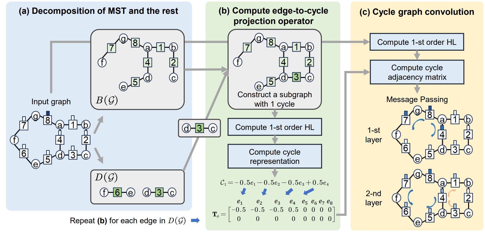

# CycGAT
Topological Cycle Graph Attention Network

This study, we introduce a novel Topological Cycle Graph Attention Network (CycGAT), designed to delineate
a functional backbone within brain functional graphs—key pathways essential for signal transmission—from 
non-essential, redundant connections that form cycles around this core structure. 

In this package, we provide the computation of both the group-level and individual-level cycle basis. 
Then we provide a detailed implementation of the proposed model. CycGAT is built using PyG and Pytorch.

<picture>
 
</picture>

## Python environment setup with Conda
cu102 should be replaced by the specific CUDA versions!
```bash
conda create -n HLHGCNN python=3.9
conda activate HLHGCNN
conda install pytorch==1.12.1 torchvision==0.13.1 torchaudio==0.12.1 cudatoolkit=10.2 -c pytorch

pip install -y torch-cluster==1.6.0     -f https://pytorch-geometric.com/whl/torch-1.12.1+cu102.html
pip install torch-scatter==2.0.9     -f https://pytorch-geometric.com/whl/torch-1.12.1+cu102.html
pip install torch-sparse==0.6.15      -f https://pytorch-geometric.com/whl/torch-1.12.1+cu102.html
pip install torch-geometric -f https://data.pyg.org/whl/torch-1.12.1+cu102.html

conda install -c conda-forge timm
conda install -c anaconda networkx
conda install -c conda-forge mat73
conda install -c conda-forge torchmetrics
conda clean --all
```

## file descriptions
./data:  file containing datasets, cycle basis, and data splitting.
./lib:  dataloader and convolution modules.
./Cycle_basis:  data preprocessing.
./CycGAT:  training code.

```bash
# first run Cycle_basis.m in MATLAB
# train CycGAT:
   python CycGAT.py
```

## data storage
We store all brain fMRI and DTI data in a `.mat` file organized as a cell matrix with dimensions corresponding to the number of samples by four columns. Each row within this matrix represents a sample. The first column contains the fMRI time-series data, where each entry has dimensions equal to the number of ROIs multiplied by the number of time points. The second column, which is optional, holds the structural connectivity data with dimensions of number of ROIs by number of ROIs. If structural connectivity (SC) data is unavailable, this column can be left blank. The third column includes subject information, used for prediction or further analysis. The final column records the subject ID for each sample. Please find 'data/DEMO_DATA.mat' as an example.


## Citation
If you find this work useful, please cite our paper in MICCAI 2024:
```bash
@article{huang2024topological,
  title={Topological Cycle Graph Attention Network for Brain Functional Connectivity},
  author={Huang, Jinghan and Chen, Nanguang and Qiu, Anqi},
  journal={arXiv preprint arXiv:2403.19149},
  year={2024}
}
```


